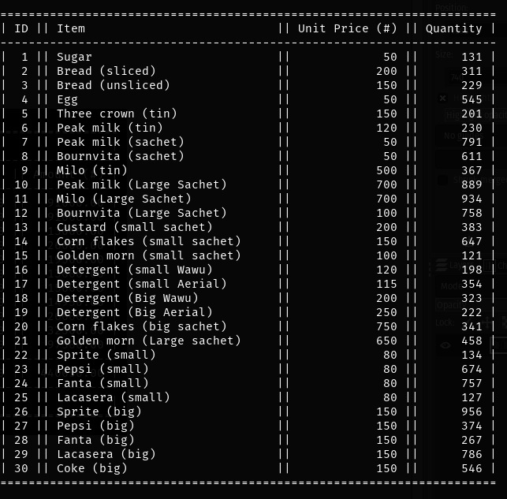
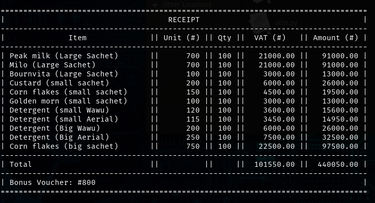

# retail-market

This is the solution to the PYTHON IFE RETAIL MARKET PROJECT.

It's meant to serve as a reference for the students of the 2020 Python Training Course by [@pythonife](https://github.com/pythonife).

Below are some snapshots:

